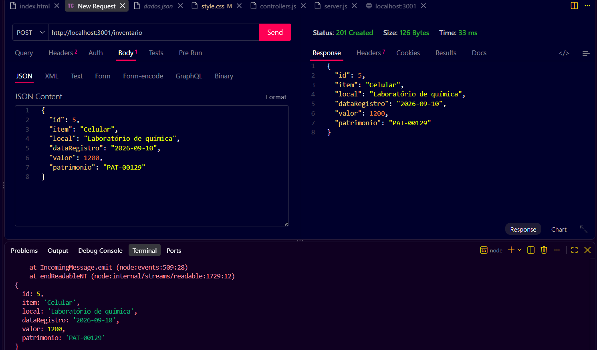
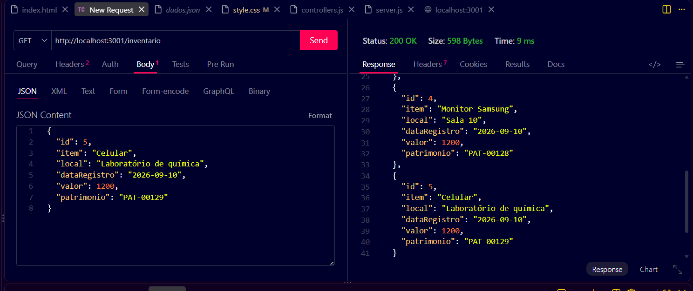

# API Inventário 
---
Projeto exemplo para aula de desenvolvimento de sistemas Back-End utilizando dados em mockup JSON

 - dados.json

# Tecnologias
---
- VsCode
- Node.js
- JavaScript
- JSON
- HTML
- CSS

  # Passo para Executar
  ---
 -  1. Clone o repositório
 -  2. Abra com VsCode e em um teminal CMD ou BASH didige:

     npm install
     npm run dev

- 3. Teste as rotas com a extensão Thunder Client do VsCode

  # Para testar o Front-End
  
  - Abra o arquivo client/index.html com a extensão Live Server do VsCode

  # Rotas
  ---
  Post time: http://localhost:3000/times
  Get times: http://localhost:3000/times
  Put time: http://localhost:3000/times/:id
  Delete time: http://localhost:3000/times/:id

# Testes com extensão Thunder Client do VsCode
---
- Create POST: http://localhost:3001/inventario
  

- Resposta

# Print do front-end
  
